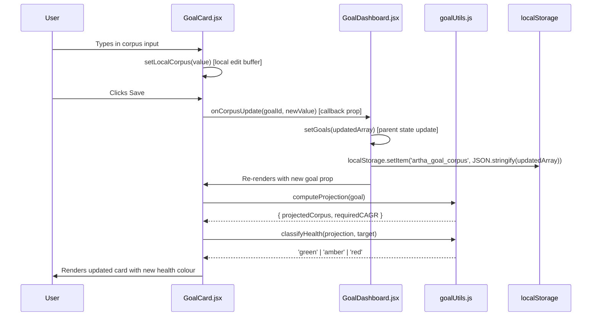
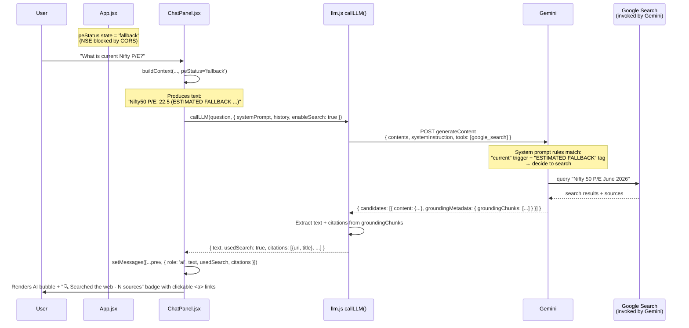
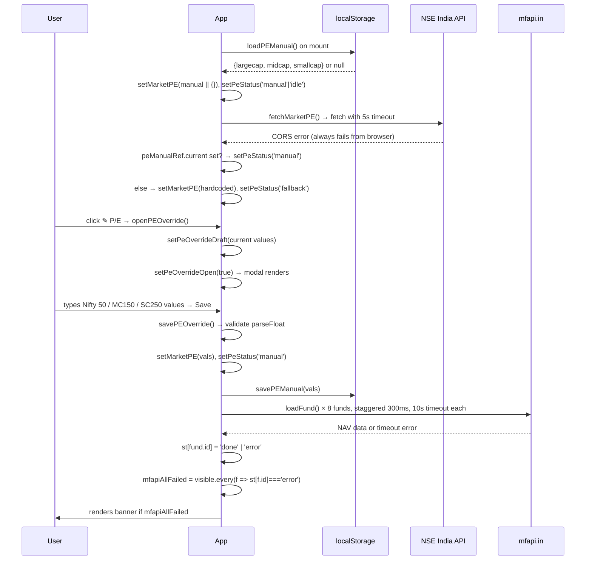

# Project Artha — Learning Log

**Purpose:** A living record of how this codebase actually works, built up entry-by-entry as features are added or modified. Written to be readable by a Python developer who's learning React/web development. Doubles as interview prep material — every entry should make sense to someone reviewing the project from outside.

**How it grows:** Claude Code appends a new entry every time a non-trivial change is made (per CLAUDE.md "Learning prompts" section). Entries are never edited or deleted — they form a chronological record of the builder's understanding deepening over time.

**Convert to Word for interview prep:** `pandoc docs/LEARNING-LOG.md -o LEARNING-LOG.docx`

---

## Entry format

Each entry follows this structure:

```
## [YYYY-MM-DD] [Backlog ID or change description]

### What changed
One-paragraph summary.

### Files touched
- path/to/file.ext — what changed and why

### Walkthrough (Python-developer framing)
End-to-end explanation. Use Python analogies where helpful.

### Data flow diagram
Mermaid sequence or flowchart.

### Mental models reinforced
- Concept bullets

### Open questions
- Things to investigate further
```

---

## [EXAMPLE — 2026-04-26] Reference entry: how an existing goal corpus update flows through the app

*This is a placeholder example entry showing the format. Real entries will be appended below this one as features are built.*

### What changed
This is the existing v4 goal corpus update flow (no code change — this entry documents pre-existing behaviour as a learning baseline). When the user types a new corpus value into a goal card and clicks save, the value flows from a controlled React input through a state setter, into localStorage, and triggers a re-render of the goal card with new health scoring.

### Files touched
- `src/components/GoalCard.jsx` — owns the input field and save button
- `src/components/GoalDashboard.jsx` — parent component that holds the goals array in state
- `src/goalUtils.js` — receives the updated corpus, recomputes projection and health status

### Walkthrough (Python-developer framing)
Think of `GoalDashboard.jsx` as a Python class that holds `self.goals = []`. In React, this is `const [goals, setGoals] = useState([])`. The variable `goals` is read-only — the only way to change it is to call `setGoals(newGoals)`, which is roughly like `self.goals = newGoals; self.render()` rolled into one call.

`GoalCard.jsx` is a child component. It's like a method that receives `self.goals[i]` as an argument. It doesn't own the goal — it just renders it and reports user actions back upward via a callback prop (`onCorpusUpdate`). This is React's "data flows down, events flow up" rule. In Python terms: parent passes data to child as kwargs, child calls `self.parent.handle_event()` to communicate back.

When the user types in the input, every keystroke calls `setLocalCorpus(e.target.value)` — a local state in `GoalCard` that holds the in-progress edit. This is like a temporary buffer before commit. When they click Save, `onCorpusUpdate(goalId, newValue)` fires. That callback was passed in by `GoalDashboard`, which then:
1. Updates the `goals` array via `setGoals(...)`
2. Persists the new array to `localStorage` (key: `artha_goal_corpus`)
3. Triggers a re-render — React diffs the new array against the old, sees one goal changed, and re-renders just that `GoalCard`

The recomputation of health status (Green/Amber/Red) happens during the re-render. `GoalCard` calls `goalUtils.computeProjection(goal)` and `goalUtils.classifyHealth(projection, goal.target)`. These are pure functions — same inputs, same outputs, no side effects. They run on every render, but React's reconciliation makes this cheap because nothing else in the tree changed.

`localStorage.setItem` is synchronous and writes to disk on the user's machine immediately. There's no network call, no backend involved. This is why the v3/v4 architecture works at all — the entire app is client-side.

### Data flow diagram



### Mental models reinforced
- "Data flows down, events flow up" — React's unidirectional data flow. Parent owns state, child receives props + callbacks.
- `useState` returns `[value, setValue]` — `value` is read-only, `setValue` is the only way to mutate AND trigger a re-render.
- `localStorage` is synchronous, per-origin, ~5MB cap, persists across browser restarts. Free, no auth, no backend.
- Pure functions in utility modules (`goalUtils.js`) — no React imports, no side effects. Easy to unit test.
- Re-renders are cheap because of React's virtual DOM diff — it only updates what actually changed in the real DOM.

### Open questions
- What happens if `localStorage` is full (5MB cap exceeded)? Currently no error handling.
- When we migrate to Supabase (AR-1), how does this flow change? `setGoals` becomes async, and we need optimistic UI updates to avoid laggy feel.
- The `classifyHealth` function has a hardcoded threshold (90% Green, 70% Amber). Should that be user-configurable?

---

<!-- New entries below this line. Newest at the top. -->

## [2026-06-02] SW-13 (Google Search grounding for chat panel) — tool-use + prompt-engineering deep dive

### What changed
The in-app chat now lets Gemini fetch real-time web data via Google Search when it needs to. Shipped in two commits: `f33e60a` added the technical wiring (tool declaration, response parsing, citation UI), `faf51c1` added the prompt engineering that actually convinced Gemini to use the tool. Both were needed — declaring a tool isn't the same as making the model use it.

### Files touched
- `src/llm.js` — new `enableSearch` option on `callLLM()`. When true, adds `tools: [{ google_search: {} }]` to the Gemini request body. Parses `groundingMetadata.groundingChunks` from the response and returns `{ usedSearch, citations }` alongside the usual fields.
- `src/components/ChatPanel.jsx` — passes `enableSearch: true` for every chat call; renders a "🔍 Searched the web · N sources" badge with clickable citation links under AI messages where Gemini actually invoked search; expanded SYSTEM_PROMPT with explicit rules on when to search; `buildContext()` now tags P/E values with `(NSE live)` or `(ESTIMATED FALLBACK …)` based on a new `peStatus` prop.
- `src/App.jsx` — passes `peStatus` (existing state: `'idle' | 'live' | 'fallback'`) to ChatPanel as a prop so freshness is visible inside the chat context.
- `src/llm.test.js` — 13 new tests covering the tool field wiring + citation extraction + malformed-chunk safety.

### Walkthrough (Python-developer framing)

**Part 1 — What is `groundingMetadata`?**

It's a field Gemini *adds to its own response* when it invokes the `google_search` tool. We don't request it explicitly; if Gemini searches, it appears in the JSON. Shape:

```json
{
  "candidates": [{
    "content": { "parts": [{ "text": "Nifty 50 P/E is 22.8 as of..." }] },
    "groundingMetadata": {
      "webSearchQueries": ["Nifty 50 P/E June 2026"],
      "groundingChunks": [
        { "web": { "uri": "https://nseindia.com/...", "title": "NSE - Nifty 50" } },
        { "web": { "uri": "https://moneycontrol.com/...", "title": "Index Valuations" } }
      ]
    }
  }],
  "usageMetadata": { "promptTokenCount": 142, "candidatesTokenCount": 38 }
}
```

In Python terms: think of Gemini's response as a `dict` with a top-level `candidates` list. Each candidate has a `content` (the answer) and *optionally* a `groundingMetadata` key. Presence of `groundingMetadata` = Gemini searched. Absence = it answered from training/context. We do `candidate?.groundingMetadata?.groundingChunks ?? []` to safely default to an empty list when no search happened (this `?.` is JS's null-safe property access, like Python's `dict.get(key)`).

**Part 2 — What does the SYSTEM_PROMPT actually do?**

The system prompt is the "constitution" for the conversation. Gemini reads it once per call and uses it to shape every response. Critically: **declaring a tool doesn't mean the model will use it.** Without instruction, Gemini will prefer to answer from the context you already gave it. The expanded prompt now contains:

```
- USE GOOGLE SEARCH (the google_search tool you have access to) whenever:
  (a) the user asks about "current", "today's", "latest", or "live" market data;
  (b) any value in the portfolio context is marked "(ESTIMATED FALLBACK)" — these are stale and you must verify the live value via search before reporting it;
  (c) the user asks about recent fund news, market events, scheme manager changes, or anything that may have changed after your training data.
  Do NOT search for advice-style questions (e.g., "should I lump-sum?", "is my SIP enough?") — answer those from the deterministic portfolio context.
```

Two principles at work here:

1. **Trigger phrases are cheap pattern matches.** Words like "current", "today's", "latest" let the model identify search-worthy queries without deep reasoning. This is how LLMs "decide" when to use tools — pattern matching against the system prompt's rules.
2. **Negative rules are as important as positive ones.** The `Do NOT search for ...` line prevents over-searching. Without it, Gemini might search for "should I lump-sum?" and waste tokens (and time). The deterministic portfolio context is already authoritative for advice questions.

This is **pure prompt engineering** — no code changed in how Gemini works, only what we tell it.

**Part 3 — How the P/E tag works**

The `(NSE live)` or `(ESTIMATED FALLBACK …)` suffix is plain string concatenation inside `buildContext()`. Python equivalent:

```python
pe_tag = "(NSE live)" if pe_status == "live" else "(ESTIMATED FALLBACK — NSE blocked by CORS; may be weeks out of date — verify via Google Search if user asks about current values)"
pe_str = f"Nifty50 P/E: {pe.largecap:.1f} {pe_tag}"
```

JS version (in `ChatPanel.jsx`):
```js
const peTag = peStatus === 'live'
  ? '(NSE live)'
  : '(ESTIMATED FALLBACK — NSE blocked by CORS; may be weeks out of date — verify via Google Search if user asks about current values)'
const peStr = pe.largecap ? `Nifty50 P/E: ${pe.largecap.toFixed(1)} ${peTag}` : null
```

Gemini reads the resulting string verbatim. It sees "ESTIMATED FALLBACK" and matches it against rule (b) in the system prompt → invokes search. The whole mechanism is text comparison inside the model.

Why this matters: Gemini doesn't have a "freshness flag" parameter we could pass structurally. The only channel is text in the system prompt. So we use a recognizable token (`ESTIMATED FALLBACK`) that matches a rule we wrote.

**Part 4 — How citations become clickable (this is NOT prompt-based)**

Citations are pure React rendering. No prompt involvement. The pipeline:

1. `llm.js` extracts citations from `groundingMetadata.groundingChunks` and returns them as a plain array:
   ```js
   const citations = groundingChunks
     .map(c => c?.web ? { uri: c.web.uri, title: c.web.title } : null)
     .filter(Boolean)
   ```
   This is the JS equivalent of a Python list comprehension: `[{"uri": c["web"]["uri"], "title": c["web"]["title"]} for c in chunks if "web" in c]`.

2. `ChatPanel.jsx` stores those citations on the message object in React state:
   ```js
   setMessages(prev => [...prev, {
     role: 'ai',
     text: result.text,
     usedSearch: result.usedSearch,
     citations: result.citations,
   }])
   ```

3. The JSX render loop iterates messages and, for each AI message that used search, renders an HTML anchor tag:
   ```jsx
   {msg.citations.slice(0, 5).map((c, ci) => (
     <a href={c.uri} target="_blank" rel="noopener noreferrer">
       {ci + 1}. {c.title || c.uri.replace(/^https?:\/\//, '').slice(0, 50)}
     </a>
   ))}
   ```

What each piece does:
- `<a href="...">` — standard HTML hyperlink. The **browser** handles the click and navigates to the URL.
- `target="_blank"` — open in a new tab. So the user doesn't navigate away from the chat.
- `rel="noopener noreferrer"` — security best practice. Prevents the opened tab from accessing your window.opener object (could be used for phishing).
- `c.title || c.uri.replace(...)` — display title if Gemini provided one, otherwise show a trimmed URL as fallback. The `||` is JS's logical OR with short-circuit evaluation, same as Python's `or`.

Python analogy: imagine Flask + Jinja rendering an `<a>` tag from a Python list of dicts. Same pattern, just client-side: React runs in the browser, takes the messages list, and produces HTML on the fly.

**Part 5 — `peStatus` prop drilling, explained**

In React, components are functions that receive `props` (function arguments) and return JSX (HTML-like markup). State in the parent flows down to children via props.

In `App.jsx`:
```js
const [peStatus, setPeStatus] = useState('idle')  // values: 'idle' | 'loading' | 'live' | 'fallback'
// ... NSE fetch runs, calls setPeStatus('live') on success or setPeStatus('fallback') in catch ...
return <ChatPanel peStatus={peStatus} ... />
```

In `ChatPanel.jsx`:
```js
export default function ChatPanel({ peStatus, ... }) {
  // peStatus is now usable inside this component
}
```

Python analogy:
```python
# Parent (App)
def app():
    pe_status = "fallback"   # state
    chat_panel(pe_status=pe_status)  # pass as kwarg

# Child (ChatPanel)
def chat_panel(*, pe_status, ...):
    # use pe_status
```

The React difference: when `peStatus` *changes* in App (e.g., NSE fetch succeeds and we call `setPeStatus('live')`), React automatically re-renders ChatPanel with the new value. No imperative update needed. The "prop drilling" is just the wiring that lets a value computed in one component reach a function deep inside another.

In our case the value travels: `App.jsx` (where NSE is fetched) → `<ChatPanel peStatus={peStatus} />` (prop pass) → `buildContext(funds, metrics, goalsConfig, marketPE, peStatus)` (function argument) → string interpolation in the systemPrompt that Gemini reads.

That's it. Five hops from where the freshness is known to where it lands in front of the LLM. Each hop is a function call or a render-time prop.

### Data flow diagram



### Mental models reinforced
- **Tool declaration ≠ tool use.** Saying `tools: [{ google_search: {} }]` only makes the tool *available*. The model decides per turn whether to invoke it. To make it actually search, the system prompt must contain instructions that make the model want to search.
- **Trigger phrases as cheap classifiers.** LLMs use pattern matching against the system prompt to "decide" what to do. Explicit words like "current", "today's", "latest" act as classifier keys. The model isn't reasoning about freshness — it's recognising literal strings.
- **Conditional tool use is token-efficient.** When Gemini decides not to search, the tool declaration costs almost nothing (just a few tokens to declare). You only pay search overhead when search actually runs.
- **`groundingMetadata` is the proof of search.** Its presence (specifically `groundingChunks.length > 0`) is the canonical way to know whether the response is grounded in current data vs the model's training cutoff.
- **System prompt as text-only channel.** There's no structured "this data is stale" parameter. Anything we want the model to know must be expressed as text it can pattern-match against. That's why we embed `(ESTIMATED FALLBACK)` directly in the context string.
- **Negative rules prevent over-use.** `Do NOT search for ...` is as important as the positive rule. Without it, the model would over-search and waste tokens on advice questions that don't need real-time data.
- **React props are unidirectional plumbing.** A value computed in App reaches a function deep inside a grandchild by being passed explicitly through each prop hop. No global state, no observers — just function arguments.
- **Citations are rendering, not LLM behaviour.** The clickable `<a>` tag is pure browser HTML. The LLM only returns text + URIs; React/HTML turns them into clickable links.

### Open questions
- The system prompt is now ~25 lines long. At what size does Gemini start losing rules at the bottom? Worth profiling later.
- When the user asks about an *abandoned* goal, do they get advice from the deterministic context (which excludes archived goals) or could Gemini try to search for it? Probably fine but untested.
- We pass up to 5 citations. What's the practical max Gemini returns? Should we paginate or summarise if >5?
- Live NSE P/E via SW-7 (NSE P/E multi-source fallback) would remove the need for the `ESTIMATED FALLBACK` workaround for the largecap/smallcap P/E. The search-grounding pattern remains useful for fund news / market events though.

---

## [2026-06-02] SW-7 (NSE P/E manual override) + SE-1 (Graceful API degradation)

### What changed
SW-7 adds a manual P/E override so the user can enter Nifty 50 / MC150 / SC250 P/E values from the NSE website, bypassing the CORS block that makes the NSE API unreachable from a browser. SE-1 adds a 10-second fetch timeout to mfapi.in calls and a prominent red banner when all fund cards have errored, giving the user a single "Retry all" button instead of needing to retry each card individually.

### Files touched
- `src/App.jsx` — (1) new PE_MANUAL_KEY constant + loadPEManual/savePEManual/clearPEManualStore helpers; (2) peManual state + peManualRef (useRef) to avoid stale closure in useCallback; (3) peOverrideOpen + peOverrideDraft for modal UI; (4) fetchMarketPE updated: tries NSE → checks peManualRef on failure → hardcoded fallback (June 2026 values); (5) savePEOverride / clearPEOverride / openPEOverride handlers; (6) "✎ P/E" toolbar button + "P/E manual ✎" clickable nav badge; (7) PE override modal JSX; (8) mfapiAllFailed derived boolean; (9) red banner with Retry all; (10) AbortSignal.timeout(10000) on both mfapi.in fetch calls.

### Walkthrough (Python-developer framing)
**The CORS problem:** The NSE India API blocks requests that come from a browser (any origin other than nseindia.com). This is CORS — Cross-Origin Resource Sharing. Think of it like an API that checks the `Referer` header and rejects you if you're not coming from its own website. Screener.in and Trendlyne have the same restriction, so a three-source cascade doesn't help. The fix without a backend is to let the user copy-paste values from the NSE website.

**useRef to escape stale closure:** In Python, a closure captures a variable by reference — if the enclosing scope mutates the variable, the closure sees the new value. In JavaScript, `useState` is different: `useCallback` captures the state value *at the time it's created*, so if `peManual` changes, the old closure still holds the old value. The pattern to escape this: create a `useRef(peManual)` and update it every time peManual changes via a `useEffect`. Refs are mutable containers — reading `peManualRef.current` always gives the latest value, because you're reading the container, not a copy.

**4-state P/E status machine:** `peStatus` is now a tiny state machine with four states: `idle` (never fetched), `loading` (fetch in flight), `live` (NSE succeeded — very rare due to CORS), `manual` (user-entered values), `fallback` (NSE failed, no manual override — uses hardcoded estimates). Each state has its own badge color: green for live, blue for manual, amber for fallback, grey for loading.

**All-funds-failed detection:** `mfapiAllFailed` is a derived boolean computed every render: `visible.every(f => st[f.id] === 'error')`. This is the React equivalent of `all(status == 'error' for status in fund_statuses)`. When true, a banner appears above the fund grid. The "Retry all" button calls `FUNDS.forEach((f, i) => setTimeout(() => loadFund(f), i * 300))` — staggered 300ms delays to avoid hammering the API.

**AbortSignal.timeout:** The browser's `fetch()` never times out by default. If mfapi.in hangs, the loading spinner would spin forever. `AbortSignal.timeout(10000)` creates a signal that fires after 10 seconds, which the fetch() interprets as an abort — the Promise rejects, the catch block runs, and `st[fund.id]` is set to `'error'`.

### Data flow diagram


### Mental models reinforced
- **CORS is a browser security feature, not a server feature.** The server doesn't know or care — it's the *browser* that refuses to forward the response to your JS code when the CORS headers are missing. The same request works fine from Python/curl/Postman.
- **useRef as a mutable escape hatch.** When you need a callback to always read the *current* value of a state variable without re-creating the callback every time the state changes, use a ref. Update the ref in a useEffect, read `ref.current` inside the callback.
- **Derived state vs. computed-on-render.** `mfapiAllFailed` is not stored in useState — it's recomputed every render from `st` (the status map). In Python terms: it's a `@property`, not an instance variable. React encourages this — avoid storing derived values in state, since they can go out of sync.
- **AbortSignal.timeout is the timeout you were always missing.** The native fetch API has no built-in timeout. AbortSignal.timeout() is the clean modern fix — no setTimeout + controller.abort() boilerplate.
- **localStorage is synchronous, fetch is async.** Loading manual PE from localStorage on mount is instant (synchronous read), so we can use it as the useState initializer: `useState(() => loadPEManual() || {})`. This avoids a blank frame before the async NSE fetch completes.

### Open questions
- When the NSE CORS block eventually goes away (or AR-11 Cloudflare Worker is built), the manual override should still be honoured until the user explicitly clears it — does the current logic handle this? Yes: `fetchMarketPE` only overwrites with live data if NSE succeeds; manual is the fallback when NSE fails.
- Should we show *when* the manual P/E was last set? Currently there's no timestamp. Could add `savedAt: Date.now()` to the stored object and show "set 3 days ago" in the badge.
- The "Retry all" button uses the same staggered-setTimeout pattern as initial load. If the user clicks it twice rapidly, you'd get duplicate loads. Worth adding a guard (check if st[f.id] === 'loading' before firing) once this becomes a real usability issue.

---
